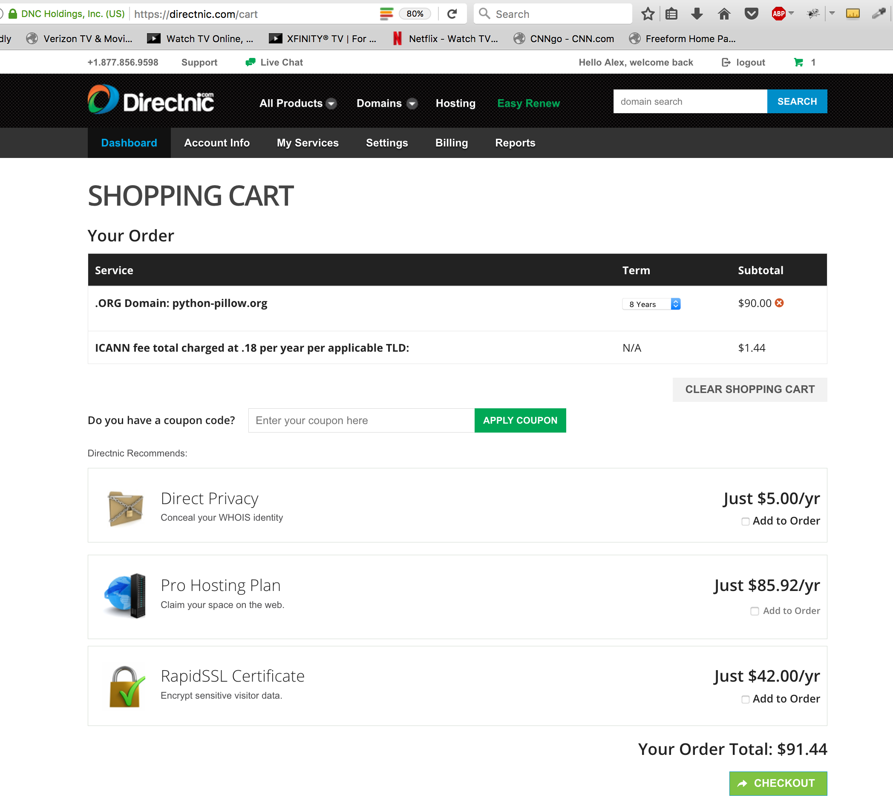

python-pillow.org
=================

Proposal submitted to the Python Software Foundation Thursday Feb 9, 2017.

Grant Proposal
--------------

Provide funding to **renew python-pillow.org** for maximum period of time of 8 years. [0]_

Abstract
~~~~~~~~

The **Python Imaging Library** is one of the oldest and most popular third party libraries available to Python programmers today. It adds support for opening, manipulating, and saving many different image file formats. [1]_

**Pillow** is a popular and well-maintained packaging fork of the Python Imaging Library. At the time of this writing it has been downloaded over a 15 million times from the Python Package Index [2]_ and is now included in major Linux distributions like Debian and Ubuntu. [1]_

History
~~~~~~~

Frustrated with the proliferation of third party repackagings of PIL containing ad hoc changes, none of which were available to download from the Python Package Index, on July 31, 2010 Alex Clark created a fork of the Python Imaging Library based on Hanno Schlicting's repackaging [4]_ and published the results to the Python Package Index as Pillow 1.0 [5]_.

The ability to add additional development library paths to ``setup.py`` (e.g. 64 bit library and headers directories) and make releases quickly eventually led to widespread adoption of Pillow.

A little over a year later on 2011-09-08, Takayuki Shimizukawa [6]_ uploaded the first Windows (win32) eggs. Since then, every Pillow release included Windows eggs thanks to Takayuki. And on 2013-02-02, the first 64-bit Windows eggs (amd64) were uploaded to PyPI by Takayuki.

For the first 3 years, the fork focused on packaging fixes only. In 2013, a Python 3 compatible pull request from Brian Crowell [7]_ was merged and released as Pillow 2.0.0.

Shortly after the release of Pillow 2.0, Christoph Gohlke gave permission for the Pillow project to use his Unofficial Windows Binaries for Python Extension Packages. [8]_.

Grant objective
---------------

To fund, in advance, renewal of python-pillow.org for the maximum period of time allowed by the registrar.

Grant size
----------

$91.44 USD total, based on registrar's shopping cart total:

Grant beneficiaries
-------------------

ACLARK.NET, LLC is a team of professionals specializing in Python-based web applications & open source software and communities. Alex Clark is a self-employed Python Web Developer at ACLARK.NET, LLC. He is also the Pillow fork author and maintainer, and has contributed over 100 hours to Pillow development and maintenance.

Preferred method of funds delivery
----------------------------------

A check made payable to::

    ACLARK.NET, LLC

And sent to::

    ACLARK.NET, LLC
    XXXX XXXXXXXX XX
    Bethesda, MD 20814

.. [0] Allowed by DirectNIC.
.. [1] http://en.wikipedia.org/wiki/Python_Imaging_Library
.. [2] "Pillow has been downloaded 15,199,249 times!" — Via http://pypi.python.org/pypi/vanity.
.. [3] The Python Wall of SuperPowers reports over 50% of popular packages have been ported: https://python3wos.appspot.com/.
.. [4] http://dist.plone.org/thirdparty/PIL-1.1.7.tar.gz
.. [5] http://mail.python.org/pipermail/image-sig/2010-July/006423.html
.. [6] https://twitter.com/shimizukawa
.. [7] https://github.com/fluggo
.. [8] http://www.lfd.uci.edu/~gohlke/pythonlibs/
