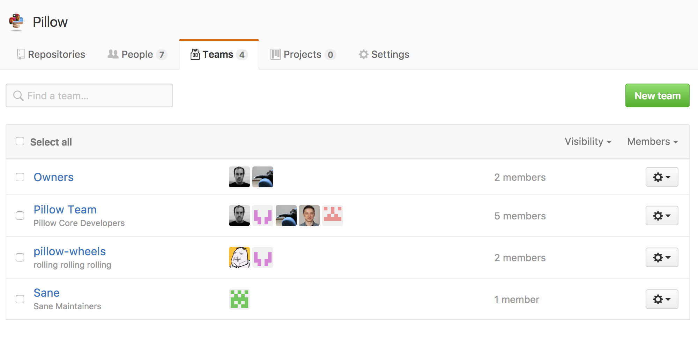
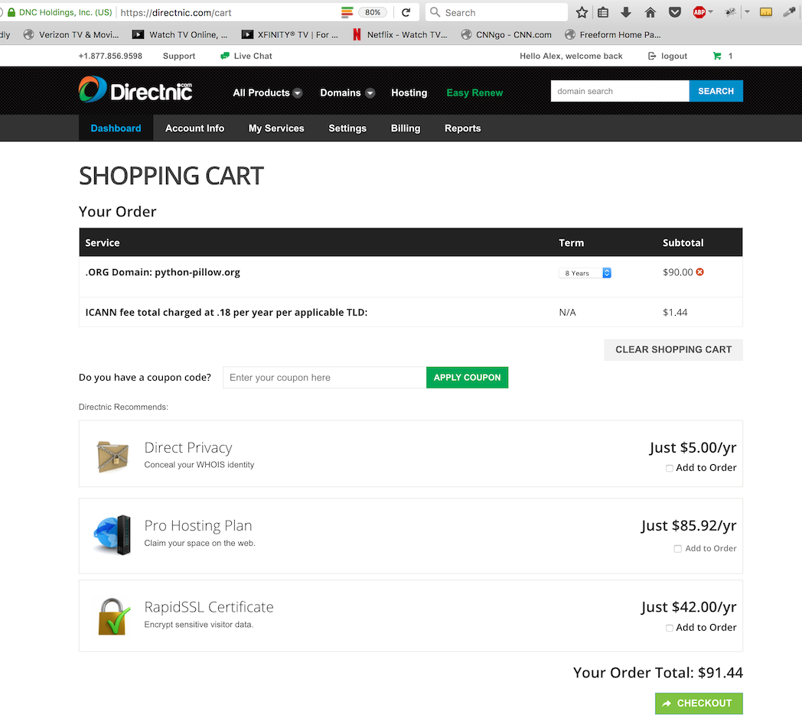

python-pillow.org
=================

Proposal submitted to the Python Software Foundation Friday, February 10, 2017.

Grant Proposal
--------------

Provide funding to **renew python-pillow.org** for maximum period of time of 8 years. [0]_ By doing so, we can ensure security issues can be reported discretely to `security@python-pillow.org` for the foreseeable future.

Abstract
~~~~~~~~

The **Python Imaging Library** is one of the oldest and most popular third party libraries available to Python programmers today. It adds support for opening, manipulating, and saving many different image file formats. [1]_

**Pillow** is a popular and well-maintained fork of the Python Imaging Library. At the time of this writing it has been downloaded over a 15 million times from the Python Package Index [2]_ and is now included in major Linux distributions like Debian and Ubuntu. [1]_

History
~~~~~~~

Frustrated with the proliferation of third party repackagings of PIL containing ad hoc changes, none of which were available to download from the Python Package Index, on July 31, 2010 **Alex Clark forked the Python Imaging Library** based on Hanno Schlicting's repackaging [4]_ and published the results to the Python Package Index as Pillow 1.0 [5]_.

Milestones
++++++++++

- The ability to add library paths to ``setup.py`` (e.g. 64 bit library and headers directories) and make timely releases quickly led to widespread adoption of Pillow within about two years.

- Just over a year after Pillow 1.0 was released, on 2011-09-08, Takayuki Shimizukawa [6]_ uploaded the first Windows (win32) eggs. Since then, every Pillow release included Windows eggs thanks to Takayuki. And on 2013-02-02, the first 64-bit Windows eggs (amd64) were uploaded to PyPI by Takayuki.

- For the first 3 years, the fork focused on packaging fixes only. In 2013, a Python 3 compatible pull request from Brian Crowell [7]_ was merged and released as Pillow 2.0.0.

- Shortly after the release of Pillow 2.0, Christoph Gohlke gave permission for the Pillow project to use his Unofficial Windows Binaries for Python Extension Packages. [8]_.

- **In 2014 the first of 12 (at present) CVEs was reported. At the time, no formal mechanism to contact the Pillow team existed. In 2016, python-pillow.org was registered and a security email address was configured to send mail to the Pillow team.** [9]_

- As of early 2017, Pillow is developed, maintained and released quarterly by 7 organization members and many more contributors.

Grant objective
---------------

To fund, in advance, renewal of python-pillow.org for the maximum period of time allowed by the registrar. By doing so, we can ensure that security issues are handled discretely and professionally for the foreseeable future.

Grant size
----------

$91.44 USD total, based on registrar's shopping cart total:

Grant beneficiaries
-------------------

Most importantly, the Python community and Pillow users will be able to reach members of the Pillow team discretely via the `security@python-pillow.org <mailto:security@python-pillow.org>`_ email address.

Preferred method of funds delivery
----------------------------------

A check made payable to::

    ACLARK.NET, LLC

And sent to::

    ACLARK.NET, LLC
    XXXX XXXXXXXX XX
    Bethesda, MD 20814

.. [0] Allowed by DirectNIC.
.. [1] http://en.wikipedia.org/wiki/Python_Imaging_Library
.. [2] "Pillow has been downloaded 15,199,249 times!" — Via http://pypi.python.org/pypi/vanity.
.. [3] The Python Wall of SuperPowers reports over 50% of popular packages have been ported: https://python3wos.appspot.com/.
.. [4] http://dist.plone.org/thirdparty/PIL-1.1.7.tar.gz
.. [5] http://mail.python.org/pipermail/image-sig/2010-July/006423.html
.. [6] https://twitter.com/shimizukawa
.. [7] https://github.com/fluggo
.. [8] http://www.lfd.uci.edu/~gohlke/pythonlibs/
.. [9] security@python-pillow.org
